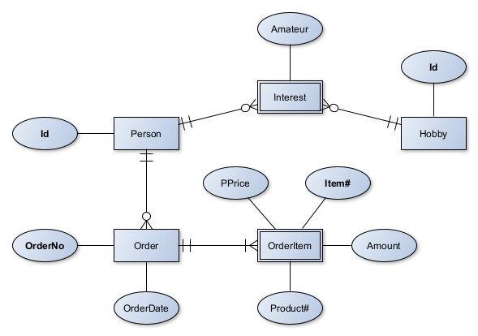

= People -- Exercise

In this exercise you are going to extend the project we started together in class.

We already completed the logic for people and their hobbies.
Now you'll add the ordering of products.

The given (starter) project not only contains the work we did in class (so all of you have access to the lastest state) but also a few bits of the new order workload.
There are _no new_ concepts, you simply have to apply what we learned together already to a new task.

== Tasks

. Complete the entities (there are still some things TODO)
. Make sure it is possible to
** _add_ an order with order items
** _update_ an existing order by _adding_ order items
** _delete_ an order and all related entities (not the Person 🙄)
. Insert test data
** Either:
*** Extend the `import.sql` file or
*** Extend the `inserts.http` file
**** Two sample requests are given -- you _don't_ have to run those if you are working with the `import.sql` file
** Insert _at least_ enough data to allow the queries described in the following to return a _meaningful_ result
. Implement queries (= query + endpoint `GET` method) for the following questions:
** Total revenue (= amount * price) of all orders for a _single_ person
** Number of orders _per_ customer (= person)
** Most common (= most often) bought product _for each_ hobby
. Write _Tests_
** Create _at least_ *two* integration tests (@QuarkusTest) testing
*** One of the methods leading to a change in a _dependent_ (weak) entity
**** e.g. Add `OrderItem` to `Order`, then `merge` the order or something like that
*** One of the _complex_ queries you implemented using `JPQL`
** Create _at least_ *one* unit test for a service
*** It has to be a service method with at least a little business logic
**** I'm aware that due to the simple nature of our application most service methods just redirect to the repository, but some do _something_.
**** You may even add an arbitrary business logic to any service method to make this task easier for you
*** _Mock_ the repository to only test the service 'unit' (and also try to use _mocking_ at least once yourself)
** If you can't remember how testing works refer to the extensive documentation of the first exercise

=== Special Task

Due to the latest events: if a student in your class is called 'Joachim' you have to complete one additional task. 😏

Add an endpoint which provides a single REST method allowing the user to submit a number and have the service perform an https://en.wikipedia.org/wiki/Integer_factorization[integer factorization] returning the result.